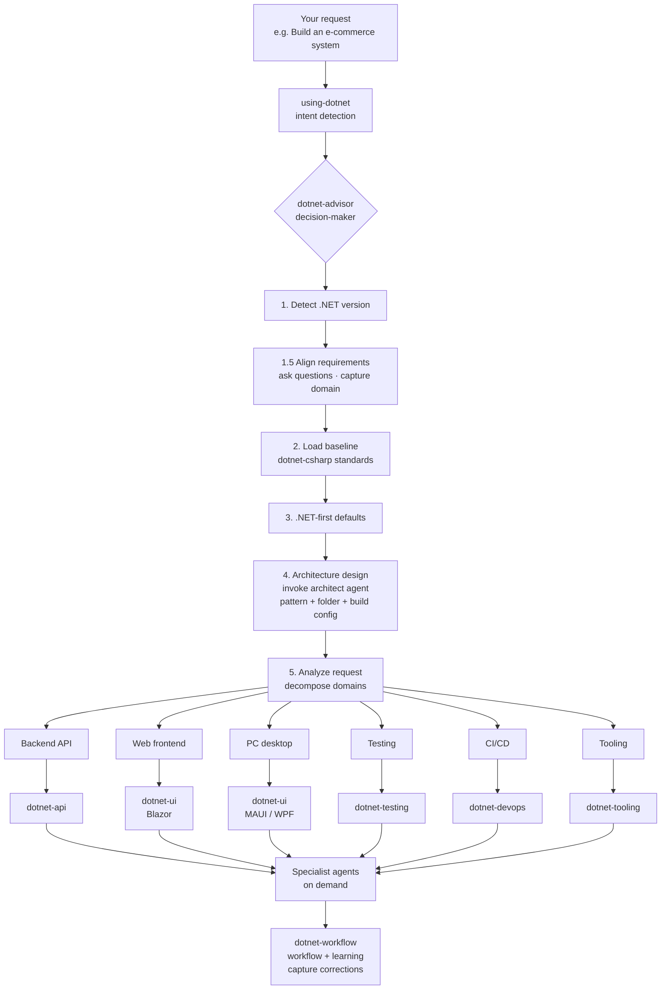

# dotnet-artisan

**Makes your AI coding agent actually good at .NET.** Install and go. Zero config.

[](README.md)
[](LICENSE)
[](skills/)
[](agents/)

11 skills · 13 agents · 160+ references · 30+ behaviors

---

## Install

```bash
claude plugins marketplace add fenzel999/dotnet-artisan
claude plugins install dotnet-artisan
```

Compatible with GitHub Copilot, VS Code, and Cursor. Open any .NET project and start working — the harness activates automatically:

- Open a .NET project → auto-loads skills + detects version
- Type a .NET prompt → auto-routes to domain skills
- Edit a .cs file → checks 30-second rule compliance

---

## Strengths & Limitations

### Strengths

- **Orchestration over collection** — The decision-maker unifies the entire flow: requirements alignment → standards loading → skill routing → agent delegation, not a scattered toolset
- **Understand before building** — Asks clarifying questions and captures domain vocabulary before writing a single line of code
- **Full coverage** — 11 skills spanning API, UI, testing, DevOps, debugging, tooling, AI; 160+ reference files with patterns and anti-patterns
- **Future-proof** — Generated code follows the 30-second rule; any AI can understand any project quickly
- **Zero commercial dependencies** — All free/open-source (MediatR→Mediator, AutoMapper→Mapperly, FluentValidation→AddValidation)
- **Cross-platform debugging** — Windows (WinDbg) and Linux/macOS (dotnet-dump + lldb)
- **Zero config** — Install and go; harness auto-activates

### Limitations

- Requires Claude Code as the AI coding agent (not a standalone tool)
- Focused on the .NET ecosystem only
- WinDbg debugging is Windows-only (Linux/macOS uses dotnet-dump instead)
- Some reference files are still being standardized

---

## How It Works

Install and go. You describe what you need — the decision-maker handles the rest:



**No skill names to memorize.** The decision-maker analyzes your project, aligns requirements, loads coding standards, and routes to the right skills and agents.

---

## Example Scenarios

Seven common scenarios showing the decision-maker aligning requirements then routing to execution.

### 1. Building an Order Management System


```

You: I need an order management system


AI: What kind of orders? Purchase orders, work orders, or customer orders?

    Who will use this?


You: Customer orders — handled by the sales team. We might split order and

     payment into separate services later.


AI: Let me work out the architecture. If you might split later, I recommend

    a modular monolith to start — separate projects per domain, single deployment.

    Domain-Driven Design (DDD) fits here: Order, Payment, and Inventory as

    bounded contexts. Sound good?


You: Yes, but our team hasn't used DDD before.


AI: I will run strategic DDD first — Event Storming, bounded contexts, domain analysis doc.
    Tactical implementation uses aggregates, entities, value objects, domain events.
    Strategic design upfront avoids costly refactoring later.
    Tech stack: .NET 10 + PostgreSQL. Need CI/CD and tests?


You: Yes.


Chain: intent detection → 4 rounds of questions → invoke dotnet-domain-analyst →
       Event Storming → bounded contexts: [Order, Payment, Inventory] →
       domain analysis doc (glossary + context diagram + aggregate design) →
       architecture decision: modular monolith + DDD strategic →
       parallel routing → dotnet-api + dotnet-testing +
       dotnet-devops + dotnet-tooling → one project per domain

```

### 2. Debugging a Production Crash (OOM)

```
You: My app keeps crashing in production — OutOfMemoryException

AI: Do you have a .dmp file? If so, I can load it in WinDbg (Windows) or dotnet-dump (Linux/macOS) for analysis.

You: Yes, at C:\dumps\crash.dmp

Chain: intent detection → load dotnet-debugging → open dump (WinDbg / dotnet-dump) →
       !analyze -v → !dumpheap -stat finds 850MB byte[] →
       !gcroot traces to ImageCache singleton → root cause report +
       fix: replace with IMemoryCache + SizeLimit
```

### 3. Code Review & Security Audit

```
You: Audit this code for security vulnerabilities

AI: I'll do a read-only security audit — no code will be modified.
    Checking: OWASP Top 10, hardcoded secrets, SQL injection, auth.

Chain: intent detection → route to dotnet-security-reviewer (read-only) →
       file-by-file scan → finds SQL injection + hardcoded key +
       missing JWT Audience validation → security report with risk levels
```

### 4. Writing Tests for Existing Code

```
You: Write tests for the order service

AI: Let me look at the code first. Business logic needs unit tests,
    database operations need integration tests.
    xUnit + WebApplicationFactory + Testcontainers — sound good?

You: Yes.

Chain: intent detection → analyze code structure → route to dotnet-testing →
       create test project → unit tests for business rules →
       Testcontainers spins up PostgreSQL → integration tests for data access
```

### 5. Upgrading from .NET 8 to .NET 10

```
You: Upgrade this project from .NET 8 to .NET 10

AI: I'll run an upgrade assessment first. Checking TFM, NuGet compatibility,
    and deprecated APIs. I recommend two steps: 8→9 then 9→10, with build
    and test verification after each step. OK?

You: Go ahead.

Chain: intent detection → assess current project → route to dotnet-devops →
       8→9: handle BinaryFormatter deprecation → build + test → commit →
       9→10: migrate to AddValidation → build + test → commit →
       replace incompatible packages with free alternatives
```

### 6. Setting Up CI/CD

```
You: Set up CI/CD for this project

AI: Let me check the project type and platform. Web API + GitHub — I'll
    generate a GitHub Actions workflow: build → format check → test
    (with Testcontainers) → Docker build. Deploys only on pushes to main.
    Sound good?

You: Yes.

Chain: intent detection → analyze project + platform → route to dotnet-devops →
       generate GHA workflow → build + format + test + docker →
       configure NuGet caching + conditional deploy trigger
```

### 7. Database Performance (EF Core N+1)

```
You: The order list page is getting slow — check the database

AI: Let me examine the query code. This looks like a classic N+1 problem —
    querying each order's line items in a loop. I'll add .Include() to
    collapse into a single SQL query and check the indexes afterward.

Chain: intent detection → route to dotnet-api (EF Core patterns) →
       review code → find N+1 loop query → add .Include() →
       single SQL query → find missing composite indexes →
       migration script + before/after performance comparison
```

### 8. Learning Project Conventions

```
You: Remember, this project uses TimeProvider instead of DateTime.Now

AI: Got it. Rule captured: prefer TimeProvider constructor injection over
    DateTime.Now/UtcNow. Applies to all new code. Stored in MEMORY.md.

Chain: intent detection → route to dotnet-workflow →
       detect correction → generalize to rule → check existing memory →
       deduplicate and write to MEMORY.md → confirm learned
```

---

## Skills

Two gateways activate first: `using-dotnet` detects .NET intent, `dotnet-advisor` (the decision-maker) analyzes your project, asks clarifying questions, and dispatches tasks.

```
Gateway  │ using-dotnet · dotnet-advisor               →  intent detection + routing
Baseline │ dotnet-csharp                                →  C# language, async/await, DI, LINQ (always loaded)
Build    │ dotnet-api · dotnet-ui                       →  API / EF Core / gRPC / SignalR / Blazor / MAUI / WPF / Uno
Verify   │ dotnet-testing · dotnet-debugging            →  testing / debugging (WinDbg / dotnet-dump)
Operate  │ dotnet-devops · dotnet-tooling               →  CI/CD / solution structure + scaffold / migration + quality
Augment  │ dotnet-ai · dotnet-workflow                  →  MCP, RAG / workflow + learning
```

---

## Agents

Call them by name or let the decision-maker route automatically. Full names begin with `dotnet-`; prefix omitted below.

| You say... | Agent | Focus |
|---|---|---|
| "How should I structure this?" | architect | Architecture selection, solution structure, build config |
| "Analyze the domain" / "Run DDD" | domain-analyst | Event storming, bounded contexts, domain docs |
| "Review this PR" | code-review-agent | Correctness, performance, security |
| "Is this secure?" | security-reviewer | OWASP Top 10, secrets, crypto (read-only) |
| "How should I test this?" | testing-specialist | Strategy, pyramid design, test data |
| "Generate documentation" | docs-generator | DocFX, Mermaid, XML doc skeletons |
| "Is my middleware order correct?" | aspnetcore-specialist | Middleware, DI, request pipeline |
| "Why is it slow?" / "Design a benchmark" | performance-specialist | Async, profiling, benchmarks |
| "Build a cross-platform UI" | ui-specialist | Blazor / MAUI / Uno Platform |
| "Remember this" / "Learn this pattern" | workflow (skill) | Correction capture, generalization, memory |
| Build fails / "Clean this up" | code-lifecycle-agent | Build errors + quality pipeline |
| "Deploy to cloud?" | cloud-specialist | Aspire, AKS, App Service |
| "Crashes under load" | concurrency-specialist | Race conditions, deadlocks, locks |
| "Create a PR" / "Release" | pr-workflow | PR lifecycle, merge, tagging |

Full catalog: [BEHAVIORS.md](BEHAVIORS.md)

---

## Key Rules

1. **DbContext is the repository** — No Repository/UoW wrappers. Inject DbContext directly.
2. **No FluentValidation** — On .NET 10+, use `AddValidation()` + DataAnnotations. Built-in, source-gen, AOT-safe.
3. **Free/open-source only** — MediatR to Mediator (MIT), AutoMapper to Mapperly, Newtonsoft to System.Text.Json. See [package-choices.md](skills/dotnet-csharp/references/package-choices.md).
4. **No DateTime.Now** — Use `TimeProvider`, constructor-injected everywhere.
5. **Understand before building** — Don't write a single line until you can confidently answer all 7 checklist items in [USAGE.md](USAGE.md).
6. **Self-documenting code** — A fresh AI must understand any generated project in 30 seconds. Zero exceptions.
7. **Use modern alternatives** — IHttpClientFactory, System.Text.Json source-gen, Microsoft.AspNetCore.OpenApi, Mediator (MIT). Never legacy patterns.

Quick reference: [CHEATSHEET.md](skills/CHEATSHEET.md)

---

## 30-Second Rule

Every generated project must be understandable by a fresh AI in 30 seconds. See [SELF_DOCUMENTING.md](SELF_DOCUMENTING.md).

---

## Further Reading

- [Questioning Framework](USAGE.md) — The decision-maker's 4-round discovery process
- [Behavior Catalog](BEHAVIORS.md) — All behaviors with routing logic
- [CLAUDE.md](CLAUDE.md) — Session recovery entry point
- [Web Edition](https://fenzel999.github.io/dotnet-artisan) — Interactive docs

---

MIT
