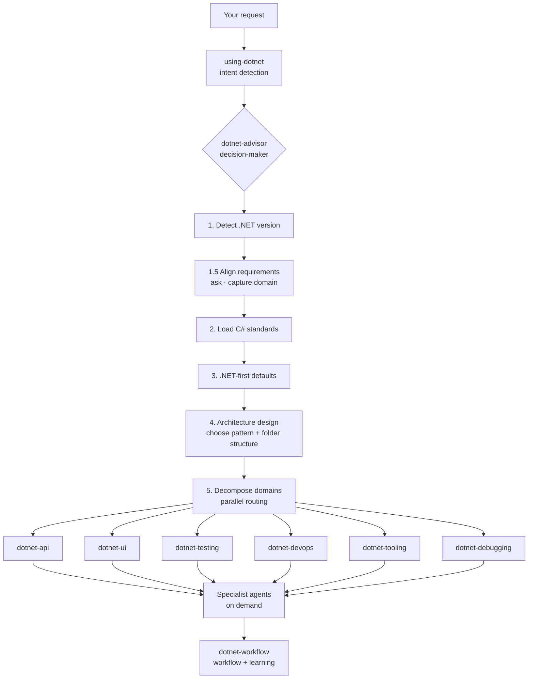

# dotnet-artisan

**Makes your AI coding agent actually good at .NET.** Install and go. Zero config.

[](README.md) [](LICENSE) 11 skills · 13 agents · 169 references · 30+ behaviors

---

## About

dotnet-artisan is a Claude Code plugin that teaches AI coding agents to write correct .NET code.

It's not a collection of scattered tools — it's a **complete .NET development agent system**. A decision-maker orchestrator analyzes requirements, captures domain vocabulary, designs architecture, then routes to the right skills for execution. From building APIs to debugging crashes, security audits to CI/CD setup, it covers the full development lifecycle.

Install and go. Zero configuration required. [Web edition →](https://fenzel999.github.io/dotnet-artisan)

---

## Install

```bash
claude plugins marketplace add fenzel999/dotnet-artisan
claude plugins install dotnet-artisan
```

Compatible with GitHub Copilot, VS Code, and Cursor. Open any .NET project and start working — the harness auto-activates (loads skills, routes prompts, checks 30-second rule).

---

## How It Works

You describe what you need — the decision-maker handles everything:



**No skill names to memorize.** The decision-maker analyzes, aligns requirements, loads standards, and routes to the right skills and agents.

---

## Examples

### 1. Building an Order Management System

```
You: I need an order management system

AI: What kind of orders? Purchase orders, work orders, or customer orders?
    Who will use this?
You: Customer orders. We might split order and payment later.

AI: I recommend a modular monolith — separate projects per domain,
    single deployment. DDD fits: Order, Payment, Inventory as
    bounded contexts. Have you used DDD before?
You: No.

AI: I'll run strategic DDD first — Event Storming, bounded contexts,
    domain analysis doc. Tactical implementation uses aggregates,
    entities, value objects. Tech stack: .NET 10 + PostgreSQL.
You: Need CI/CD and tests too.

Chain: 4 rounds of questions → dotnet-domain-analyst → Event Storming →
       bounded contexts: [Order, Payment, Inventory] → domain doc →
       parallel routing → api + testing + devops + tooling
```

### 2. Debugging a Production Crash (OOM)

```
You: My app keeps crashing — OutOfMemoryException
AI: Do you have a .dmp file?
You: Yes, C:\dumps\crash.dmp

Chain: dotnet-debugging → open dump (WinDbg/dotnet-dump) →
       !analyze -v → !dumpheap -stat finds 850MB byte[] →
       !gcroot traces to ImageCache singleton → fix recommendation
```

### 3. Code Review & Security Audit

```
You: Audit this code for security vulnerabilities
AI: Read-only audit, no code changes. Checking OWASP Top 10.

Chain: dotnet-security-reviewer (read-only) → scan → finds
       SQL injection + hardcoded key + missing JWT Audience → report
```

### 4. Writing Tests for Existing Code

```
You: Write tests for the order service
AI: Business logic needs unit tests, database needs integration tests.
    xUnit + WebApplicationFactory + Testcontainers — sound good?
You: Yes.

Chain: dotnet-testing → create test project → unit tests →
       Testcontainers spins up PostgreSQL → integration tests
```

### 5. Upgrading from .NET 8 to .NET 10

```
You: Upgrade this project from .NET 8 to .NET 10
AI: Two-step migration: 8→9 then 9→10, build+test after each step.

Chain: dotnet-devops → 8→9 (BinaryFormatter deprecation) →
       build+test → 9→10 (AddValidation) → build+test
```

### 6. Setting Up CI/CD

```
You: Set up CI/CD for this project
AI: Web API + GitHub. Generating GitHub Actions workflow,
    deploys on pushes to main.

Chain: dotnet-devops → GHA workflow → build+format+test+docker
```

### 7. Learning Project Conventions

```
You: Remember, this project uses TimeProvider instead of DateTime.Now
AI: Rule captured: TimeProvider constructor injection preferred.
    Applied to all new code. Stored in MEMORY.md.

Chain: dotnet-workflow → detect correction → generalize rule →
       deduplicate → write to MEMORY.md → confirm
```

---

## Skills

| Category | Skill | Positioning | Does NOT |
|----------|-------|-------------|----------|
| Gateway | using-dotnet | Detects .NET intent, triggers decision-maker | Non-.NET requests |
| | dotnet-advisor | Decision-maker: align → architect → route | Domain implementation |
| Baseline | dotnet-csharp | C# standards, async/await, DI, LINQ | Framework API design |
| Build | dotnet-api | Backend API, EF Core, gRPC, SignalR, security | UI rendering |
| | dotnet-ui | Blazor, MAUI, WPF, WinUI, Uno | Backend API |
| Verify | dotnet-testing | xUnit, integration, Playwright, benchmarks | Production debugging |
| | dotnet-debugging | WinDbg / dotnet-dump crash diagnostics | Unit testing |
| Operate | dotnet-devops | CI/CD, containers, migration, Git workflow | Code quality |
| | dotnet-tooling | Project structure, MSBuild, AOT, CLI, quality | CI/CD pipelines |
| Augment | dotnet-ai | MCP servers, Semantic Kernel, RAG | API development |
| | dotnet-workflow | Parallel workflows, correction learning, memory | Domain development |

---

## Agents

| You say | Agent | Focus | Mode |
|---------|-------|-------|------|
| "How should I structure this?" | architect | Architecture, folder structure, build config | Read-only |
| "Analyze the domain" | domain-analyst | Event storming, bounded contexts, domain doc | Read-Write |
| "Review this PR" | code-review-agent | Correctness, performance, security review | Read-only |
| "Is this secure?" | security-reviewer | OWASP, secrets, crypto audit | Read-only |
| "How should I test?" | testing-specialist | Strategy, pyramid design, microservice tests | Read-only |
| "Generate documentation" | docs-generator | DocFX, Mermaid, XML docs, README | Read-Write |
| "Is my middleware correct?" | aspnetcore-specialist | Middleware pipeline, DI lifetimes, API design | Read-only |
| "Why is it slow?" | performance-specialist | Async, flame graphs, GC, benchmarks | Read-only |
| "Build a cross-platform UI" | ui-specialist | Blazor/MAUI/Uno framework choice, render modes | Read-only |
| "Remember this" | workflow (skill) | Correction capture, generalization, memory | Read-Write |
| Build fails | code-lifecycle-agent | MSBuild/NuGet/SDK errors | Read-Write |
| "Clean this up" | code-lifecycle-agent | 7-step quality pipeline | Read-Write |
| "Deploy to cloud?" | cloud-specialist | Aspire, AKS, distributed tracing | Read-only |
| "Crashes under load" | concurrency-specialist | Race conditions, deadlocks, thread safety | Read-only |
| "Create a PR" / "Release" | pr-workflow | Create → review → merge → release | Read-Write |

Full catalog: [BEHAVIORS.md](BEHAVIORS.md)

---

## Key Rules

1. **DbContext is the repository** — No Repository/UoW wrappers. Inject directly.
2. **No FluentValidation** — .NET 10+ uses `AddValidation()` + DataAnnotations.
3. **Free/open-source only** — MediatR→Mediator, AutoMapper→Mapperly. See [package-choices.md](skills/dotnet-csharp/references/package-choices.md).
4. **No DateTime.Now** — Use `TimeProvider`, constructor-injected everywhere.
5. **Understand before building** — 7-item checklist before writing code. See [USAGE.md](USAGE.md).
6. **Self-documenting code** — Fresh AI must understand any project in 30 seconds.
7. **Use modern alternatives** — IHttpClientFactory, System.Text.Json source-gen, Microsoft.AspNetCore.OpenApi.

Quick reference: [CHEATSHEET.md](skills/CHEATSHEET.md)

---

## Strengths & Limitations

### Strengths

- **Orchestration over collection** — Decision-maker unifies the entire flow: alignment → standards → routing → agents
- **Understand before building** — Asks clarifying questions, captures domain vocabulary before coding
- **Full coverage** — 11 skills spanning API, UI, testing, DevOps, debugging, tooling, AI; 169 reference files
- **Future-proof** — Generated code follows the 30-second rule; any AI understands any project quickly
- **Zero commercial dependencies** — All free/open-source (MediatR→Mediator, AutoMapper→Mapperly)
- **Cross-platform debugging** — Windows (WinDbg) and Linux/macOS (dotnet-dump + lldb)
- **Zero config** — Install and go; harness auto-activates

### Limitations

- Requires Claude Code as the AI coding agent
- Focused on the .NET ecosystem only
- WinDbg debugging is Windows-only (Linux/macOS uses dotnet-dump)
- Some reference files are still being standardized

---

## Further Reading

- [Questioning Framework](USAGE.md) — The decision-maker's 4-round discovery process
- [Behavior Catalog](BEHAVIORS.md) — All behaviors with routing logic
- [CLAUDE.md](CLAUDE.md) — Session recovery entry point

---

MIT
