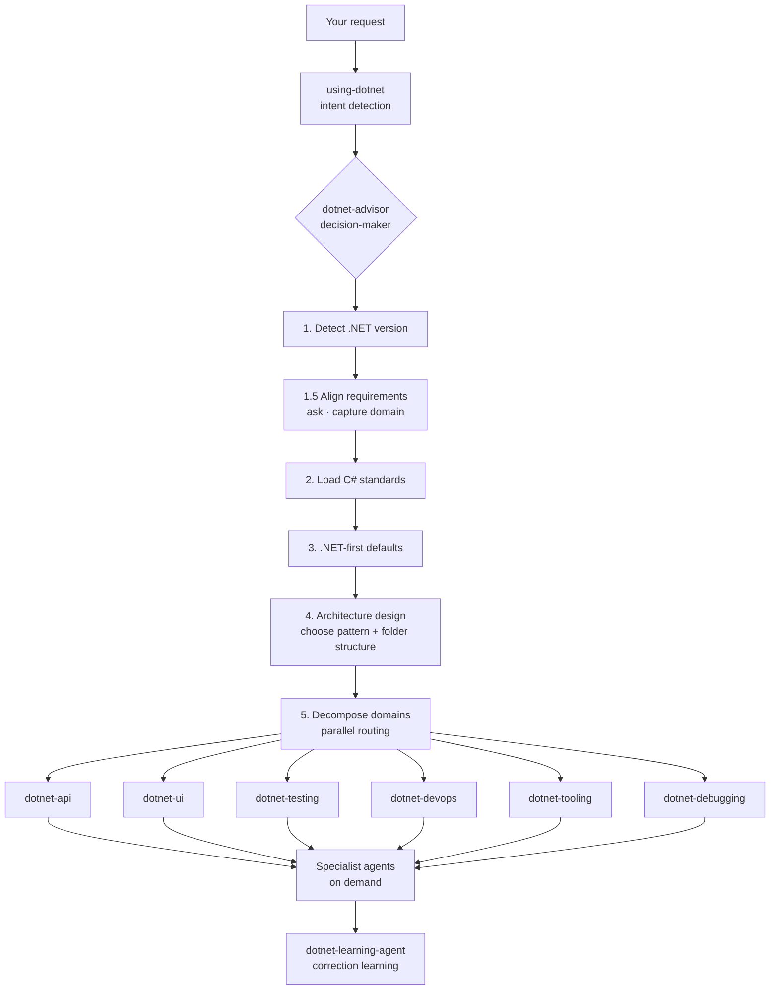

# dotnet-artisan

**Makes your AI coding agent actually good at .NET.** Install and go. Zero config.

[](README.md) [](LICENSE) 11 skills · 14 agents · 169 references · 30+ behaviors

---

## About

dotnet-artisan is a Claude Code plugin that teaches AI coding agents to write correct .NET code.

It's not a collection of scattered tools — it's a **complete .NET development agent system**. A decision-maker orchestrator analyzes requirements, captures domain vocabulary, designs architecture, then routes to the right skills for execution. From building APIs to debugging crashes, security audits to CI/CD setup, it covers the full development lifecycle.

Install and go. Zero configuration required. [Web edition →](https://fenzel999.github.io/dotnet-artisan)

---

## Install

```bash
claude plugins marketplace add fenzel999/dotnet-artisan
claude plugins install dotnet-artisan
```

Compatible with GitHub Copilot, VS Code, and Cursor. Open any .NET project and start working — the harness auto-activates (loads skills, routes prompts, checks 30-second rule).

---

## How It Works

You describe what you need — the decision-maker handles everything:



**No skill names to memorize.** The decision-maker analyzes, aligns requirements, loads standards, and routes to the right skills and agents.

---

## Examples

### 1. Building an Order Management System

```
You: I need an order management system

AI: What kind of orders? Purchase orders, work orders, or customer orders?
    Who will use this?
You: Customer orders. We might split order and payment later.

AI: I recommend a modular monolith — separate projects per domain,
    single deployment. DDD fits: Order, Payment, Inventory as
    bounded contexts. Have you used DDD before?
You: No.

AI: I'll run strategic DDD first — Event Storming, bounded contexts,
    domain analysis doc. Tactical implementation uses aggregates,
    entities, value objects. Tech stack: .NET 10 + PostgreSQL.
You: Need CI/CD and tests too.

Chain: 4 rounds of questions → dotnet-domain-analyst → Event Storming →
       bounded contexts: [Order, Payment, Inventory] → domain doc →
       parallel routing → api + testing + devops + tooling
```

### 2. Debugging a Production Crash (OOM)

```
You: My app keeps crashing — OutOfMemoryException
AI: Do you have a .dmp file?
You: Yes, C:\dumps\crash.dmp

Chain: dotnet-debugging → open dump (WinDbg/dotnet-dump) →
       !analyze -v → !dumpheap -stat finds 850MB byte[] →
       !gcroot traces to ImageCache singleton → fix recommendation
```

### 3. Code Review & Security Audit

```
You: Audit this code for security vulnerabilities
AI: Read-only audit, no code changes. Checking OWASP Top 10.

Chain: dotnet-security-reviewer (read-only) → scan → finds
       SQL injection + hardcoded key + missing JWT Audience → report
```

### 4. Writing Tests for Existing Code

```
You: Write tests for the order service
AI: Business logic needs unit tests, database needs integration tests.
    xUnit + WebApplicationFactory + Testcontainers — sound good?
You: Yes.

Chain: dotnet-testing → create test project → unit tests →
       Testcontainers spins up PostgreSQL → integration tests
```

### 5. Upgrading from .NET 8 to .NET 10

```
You: Upgrade this project from .NET 8 to .NET 10
AI: Two-step migration: 8→9 then 9→10, build+test after each step.

Chain: dotnet-devops → 8→9 (BinaryFormatter deprecation) →
       build+test → 9→10 (AddValidation) → build+test
```

### 6. Setting Up CI/CD

```
You: Set up CI/CD for this project
AI: Web API + GitHub. Generating GitHub Actions workflow,
    deploys on pushes to main.

Chain: dotnet-devops → GHA workflow → build+format+test+docker
```

### 7. Learning Project Conventions

```
You: Remember, this project uses TimeProvider instead of DateTime.Now
AI: Rule captured: TimeProvider constructor injection preferred.
    Applied to all new code. Stored in MEMORY.md.

Chain: dotnet-learning-agent → detect correction → generalize rule →
       deduplicate → write to MEMORY.md → confirm
```

---

## Skills

| Category | Skill | Positioning |
|----------|-------|-------------|
| Gateway | [using-dotnet](skills/using-dotnet/SKILL.md) | Detects .NET intent, triggers decision-maker |
| | [dotnet-advisor](skills/dotnet-advisor/SKILL.md) | Decision-maker: align → architect → route |
| Baseline | [dotnet-csharp](skills/dotnet-csharp/SKILL.md) | C# standards, async/await, DI, LINQ (always loaded) |
| Build | [dotnet-api](skills/dotnet-api/SKILL.md) | Backend API, EF Core, gRPC, SignalR, security |
| | [dotnet-ui](skills/dotnet-ui/SKILL.md) | Blazor, MAUI, WPF, WinUI, Uno |
| Verify | [dotnet-testing](skills/dotnet-testing/SKILL.md) | xUnit, integration, Playwright, benchmarks |
| | [dotnet-debugging](skills/dotnet-debugging/SKILL.md) | WinDbg / dotnet-dump crash diagnostics |
| Operate | [dotnet-devops](skills/dotnet-devops/SKILL.md) | CI/CD, containers, migration, Git workflow |
| | [dotnet-tooling](skills/dotnet-tooling/SKILL.md) | Project structure, AOT, CLI, performance, quality |
| Augment | [dotnet-ai](skills/dotnet-ai/SKILL.md) | MCP servers, Semantic Kernel, RAG |
| | [dotnet-workflow](skills/dotnet-workflow/SKILL.md) | Parallel workflows, context management, verification loops |

---

## Agents

| Category | Agent | Focus | Mode |
|----------|-------|-------|------|
| Design | [architect](agents/dotnet-architect.md) | Architecture, folder structure, build config | Read-only |
| | [domain-analyst](agents/dotnet-domain-analyst.md) | Event storming, bounded contexts, domain doc | Read-Write |
| Development | [aspnetcore-specialist](agents/dotnet-aspnetcore-specialist.md) | Middleware pipeline, DI lifetimes, API design | Read-only |
| | [ui-specialist](agents/dotnet-ui-specialist.md) | Blazor/MAUI/Uno framework choice, render modes | Read-only |
| | [performance-specialist](agents/dotnet-performance-specialist.md) | Async, flame graphs, GC, benchmarks | Read-only |
| | [concurrency-specialist](agents/dotnet-csharp-concurrency-specialist.md) | Race conditions, deadlocks, thread safety | Read-only |
| Quality | [testing-specialist](agents/dotnet-testing-specialist.md) | Strategy, pyramid design, microservice tests | Read-only |
| | [code-review-agent](agents/dotnet-code-review-agent.md) | Correctness, performance, security review | Read-only |
| | [security-reviewer](agents/dotnet-security-reviewer.md) | OWASP, secrets, crypto audit | Read-only |
| Operations | [cloud-specialist](agents/dotnet-cloud-specialist.md) | Aspire, AKS, distributed tracing | Read-only |
| | [code-lifecycle-agent](agents/dotnet-code-lifecycle-agent.md) | Build errors + 7-step quality pipeline | Read-Write |
| | [pr-workflow](agents/dotnet-pr-workflow.md) | PR lifecycle: create → review → merge → release | Read-Write |
| Support | [docs-generator](agents/dotnet-docs-generator.md) | DocFX, Mermaid, XML docs, README | Read-Write |
| | [dotnet-learning-agent](agents/dotnet-learning-agent.md) | Correction capture, generalization, memory | Read-Write |

---

## Further Reading

- [USAGE.md](USAGE.md) — Understand before building: 7-item checklist, 4-round questioning, domain-driven analysis
- [Design Principles](skills/CHEATSHEET.md) — DbContext as repository, no FluentValidation, TimeProvider everywhere
- [BEHAVIORS.md](BEHAVIORS.md) — Full behavior catalog, routing logic, agent triggers
- [CLAUDE.md](CLAUDE.md) — Plugin architecture, file map, session recovery protocol
- [SELF_DOCUMENTING.md](SELF_DOCUMENTING.md) — 30-second rule: write code any AI can read

---

MIT
