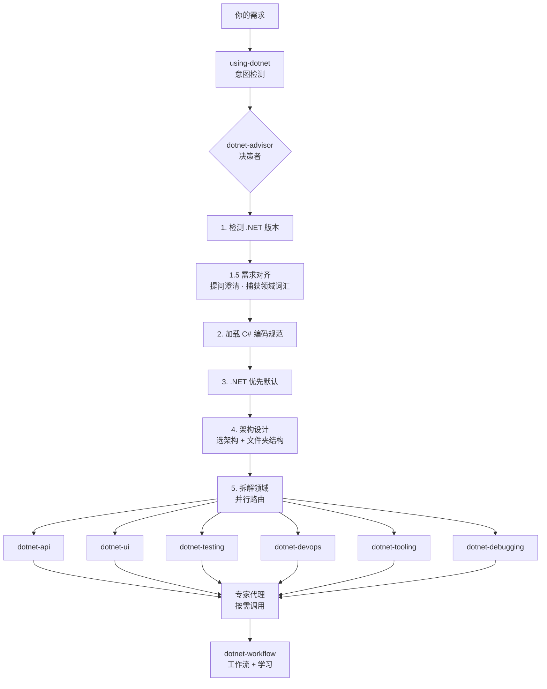

# dotnet-artisan

**让你的 AI 编码代理真正精通 .NET。** 即装即用，零配置。

[](README.en.md) [](LICENSE) 11 技能 · 13 代理 · 169 参考文件 · 30+ 行为

---

## 简介

dotnet-artisan 是一个 Claude Code 插件，让 AI 编码代理能够正确地编写 .NET 代码。

它不是一个零散的工具集合，而是一个**完整的 .NET 开发智能体系统**。核心是一个决策者编排器，它会先分析需求、捕获领域词汇、设计架构，然后路由到对应技能去执行——从 API 搭建到调试崩溃，从安全审计到 CI/CD 配置，覆盖完整的开发生命周期。

装完即用，无需任何配置。

---

## 安装

```bash
claude plugins marketplace add fenzel999/dotnet-artisan
claude plugins install dotnet-artisan
```

兼容 GitHub Copilot、VS Code、Cursor。装完打开任意 .NET 项目即用，Harness 自动激活（加载技能、路由提示、检查 30 秒法则）。

---

## 工作流程

你提需求，决策者统一编排全过程：



**你不需要记任何技能名。** 决策者自动分析项目、对齐需求、加载规范、路由到正确的技能和代理。

---

## 场景示例

### 1. 从零搭建订单管理系统

```
你：我需要一个订单管理系统

AI：什么样的订单？采购订单、工单还是顾客订单？谁在使用？
你：顾客下单，销售团队处理。未来可能会拆分订单和支付。

AI：建议从模块化单体开始，按领域拆项目但不拆部署。
    DDD 适合你的场景：订单、支付、库存作为限界上下文。
    你们之前用过 DDD 吗？
你：没有。

AI：我会先做战略设计——Event Storming 发现领域事件，
    划分限界上下文，输出领域分析文档。战术实现
    用聚合、实体、值对象。技术栈：.NET 10 + PostgreSQL。
你：好，需要 CI/CD 和测试。

行为链：4 轮提问 → dotnet-domain-analyst → Event Storming →
       限界上下文：[订单、支付、库存] → 输出领域文档 →
       并行路由 → dotnet-api + dotnet-testing + dotnet-devops + dotnet-tooling
```

### 2. 排查生产崩溃（内存溢出）

```
你：我的应用在生产环境一直崩溃——OutOfMemoryException
AI：有 .dmp 文件吗？
你：有，C:\dumps\crash.dmp

行为链：dotnet-debugging → 打开转储（WinDbg/dotnet-dump）→
       !analyze -v → !dumpheap -stat 发现 850MB byte[] →
       !gcroot 追溯到 ImageCache 单例 → 修复方案
```

### 3. 代码审查与安全审计

```
你：审查这段代码的安全性
AI：好的，只读安全审计，不修改代码。检查 OWASP Top 10。

行为链：dotnet-security-reviewer（只读）→ 扫描 → 发现
       SQL 拼接 + 硬编码密钥 + JWT 缺 Audience → 安全报告
```

### 4. 为现有代码补测试

```
你：给这个订单服务写测试
AI：核心逻辑适合单元测试，数据库需要集成测试。
    xUnit + WebApplicationFactory + Testcontainers 可以吗？
你：可以。

行为链：dotnet-testing → 创建测试项目 → 单元测试 →
       Testcontainers 启动 PostgreSQL → 集成测试
```

### 5. 从 .NET 8 升级到 .NET 10

```
你：把这个项目从 .NET 8 升到 .NET 10
AI：先做升级评估，分两步走：8→9 再 9→10，每步 build+test。

行为链：dotnet-devops → 8→9（BinaryFormatter 废弃）→
       build+test → 9→10（AddValidation）→ build+test
```

### 6. 配置 CI/CD 流水线

```
你：给这个项目配 CI/CD
AI：Web API + GitHub，生成 GitHub Actions 工作流，
    推送到 main 时触发部署。

行为链：dotnet-devops → 生成 GHA 工作流 → build+format+test+docker
```

### 7. 记住项目约定

```
你：记住，这个项目用 TimeProvider 而不是 DateTime.Now
AI：已捕获规则：TimeProvider 构造函数注入优先。
    适用于所有新代码，已存入 MEMORY.md。

行为链：dotnet-workflow → 检测纠错 → 泛化规则 →
       去重 → 写入 MEMORY.md → 确认
```

---

## 技能

| 分类 | 技能 | 覆盖 |
|------|------|------|
| 网关 | using-dotnet, dotnet-advisor | 意图检测 + 决策路由 |
| 基线 | dotnet-csharp | C# 规范、async/await、DI、LINQ（始终加载） |
| 构建 | dotnet-api, dotnet-ui | API / EF Core / gRPC / SignalR / Blazor / MAUI / WPF / Uno |
| 验证 | dotnet-testing, dotnet-debugging | 测试 / 调试（WinDbg + dotnet-dump） |
| 运维 | dotnet-devops, dotnet-tooling | CI/CD / 版本迁移 / Git 工作流 / 脚手架 / 代码质量 |
| 增强 | dotnet-ai, dotnet-workflow | MCP、RAG / 工作流优化 + 学习 |

---

## 代理

| 你说 | 代理 | 专长 |
|------|------|------|
| "这个项目怎么架构？" | architect | 架构选型、文件夹结构、构建配置 |
| "分析领域" | domain-analyst | 事件风暴、限界上下文、领域文档 |
| "审查 PR" | code-review-agent | 正确性、性能、安全、架构 |
| "代码安全吗？" | security-reviewer | OWASP、密钥、加密（只读） |
| "怎么测试？" | testing-specialist | 测试策略、金字塔设计 |
| "生成文档" | docs-generator | DocFX、Mermaid |
| "中间件顺序对吗？" | aspnetcore-specialist | 中间件、DI、请求管道 |
| "为什么慢？" / "设计基准" | performance-specialist | 异步、性能分析、基准 |
| "做跨平台 UI" | ui-specialist | Blazor / MAUI / Uno |
| "记住这个" | workflow（技能） | 纠错捕获、模式泛化 |
| 构建失败 / "清理代码" | code-lifecycle-agent | 构建错误 + 质量清理 |
| "部署到云？" | cloud-specialist | Aspire、AKS |
| "高并发出问题" | concurrency-specialist | 竞态条件、死锁 |
| "创建 PR" / "发布" | pr-workflow | PR 生命周期 |

完整列表：[BEHAVIORS.md](BEHAVIORS.md)

---

## 核心规则

1. **DbContext 即仓储** — 禁止 Repository/UoW 包装，直接注入
2. **禁止 FluentValidation** — .NET 10+ 用 `AddValidation()` + DataAnnotations
3. **仅用免费/开源包** — MediatR→Mediator, AutoMapper→Mapperly，详见 [package-choices.md](skills/dotnet-csharp/references/package-choices.md)
4. **禁止 DateTime.Now** — 全部用 `TimeProvider`，构造函数注入
5. **先理解再动手** — 7 项检查清单自信回答前不写代码，详见 [USAGE.md](USAGE.md)
6. **自文档化代码** — 新 AI 在 30 秒内理解项目
7. **使用现代替代** — IHttpClientFactory、System.Text.Json 源码生成、Microsoft.AspNetCore.OpenApi

速查：[CHEATSHEET.md](skills/CHEATSHEET.md)

---

## 优势与局限

### 优势

- **编排而非堆砌** — 决策者统一编排：需求对齐 → 规范加载 → 技能路由 → 专家代理
- **先理解再动手** — 写代码前先提问澄清，捕获领域词汇，避免在假设上构建
- **全覆盖** — 11 技能覆盖 API、UI、测试、DevOps、调试、工具链、AI；169 参考文件
- **长期可用** — 生成的代码遵循 30 秒法则，任何 AI 都能快速理解
- **零商业依赖** — 全部免费/开源（MediatR→Mediator，AutoMapper→Mapperly）
- **跨平台调试** — Windows（WinDbg）和 Linux/macOS（dotnet-dump + lldb）
- **零配置** — 装完即用，Harness 自动激活

### 局限

- 需要 Claude Code 作为 AI 编码代理
- 专注于 .NET 生态
- WinDbg 调试仅支持 Windows（Linux/macOS 用 dotnet-dump 替代）
- 部分参考文件仍在标准化格式中

---

## 了解更多

- [提问框架](USAGE.md) — 决策者的 4 轮发现流程
- [行为目录](BEHAVIORS.md) — 全部行为及路由逻辑
- [CLAUDE.md](CLAUDE.md) — 上下文恢复入口

---

MIT
