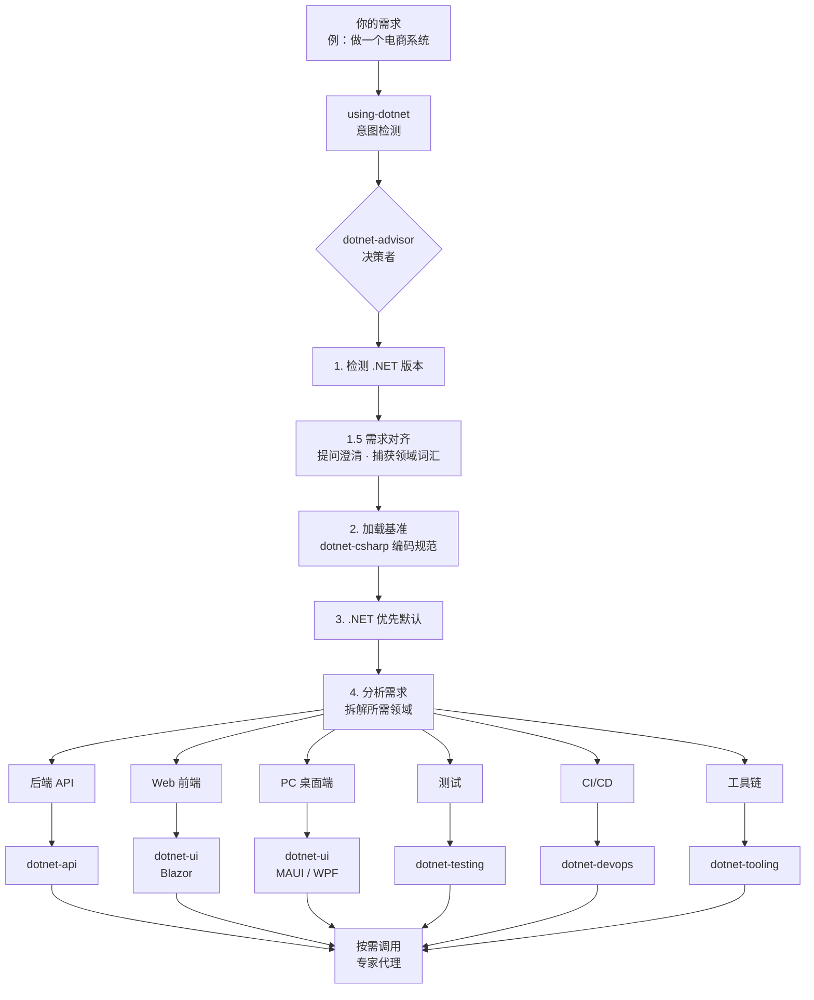

# dotnet-artisan

**让你的 AI 编码代理真正精通 .NET。** 即装即用，零配置。

[](README.en.md)
[](LICENSE)
[](skills/)
[](agents/)

11 技能 · 13 代理 · 160+ 参考文件 · 30+ 行为

---

## 安装

```bash
claude plugins marketplace add fenzel999/dotnet-artisan
claude plugins install dotnet-artisan
```

兼容 GitHub Copilot、VS Code、Cursor。装完打开任意 .NET 项目即用，Harness 自动激活。

---

## 优势与局限

### 优势

- **编排而非堆砌** — 决策者统一编排：需求对齐 → 规范加载 → 技能路由 → 专家代理，不是零散的工具集合
- **先理解再动手** — 在写代码前先提问澄清，捕获领域词汇，避免在假设上构建
- **全覆盖** — 11 个技能覆盖 API、UI、测试、DevOps、调试、工具链、AI，160+ 参考文件附带模式与反模式
- **长期可用** — 生成的代码遵循 30 秒法则，任何 AI 都能快速理解
- **零商业依赖** — 全部免费/开源（MediatR→Mediator，AutoMapper→Mapperly，FluentValidation→AddValidation）
- **跨平台调试** — Windows（WinDbg）和 Linux/macOS（dotnet-dump + lldb）均支持
- **零配置** — 装完即用，Harness 自动激活

### 局限

- 需要 Claude Code 作为 AI 编码代理，不能独立使用
- 专注于 .NET 生态，不覆盖其他语言/框架
- WinDbg 调试仅支持 Windows（Linux/macOS 使用 dotnet-dump 替代）
- 部分参考文件仍在标准化格式中

---

## 工作流程

装完即用。你提需求，决策者自动处理整个流程：



**你不需要记任何技能名。** 决策者自动分析项目、对齐需求、加载规范、路由到正确的技能和代理。

---

## 场景示例

以下七个常见场景，展示决策者如何先对齐需求，再路由到具体技能执行。

### 1. 从零搭建订单管理系统

```
你：我需要一个订单管理系统

AI：什么样的订单？采购订单、工单还是顾客订单？谁在使用？

你：顾客下单，销售团队处理。未来可能会拆分订单和支付为独立服务。

AI：明白了。我需要先确定架构：
  单体还是微服务？如果未来要拆分，建议先从模块化单体开始——按领域拆项目，
  但不拆部署。领域驱动设计（DDD）适合复杂业务，你这个场景建议用 DDD：
  订单、支付、库存分别作为限界上下文。
  你看这样行吗？

你：可以。但我们团队之前没用过 DDD。

AI：没问题。我会先做战略设计——Event Storming 发现领域事件，
  划分限界上下文，输出领域分析文档。战术实现时用聚合、实体、
  值对象、领域事件。战略设计一步到位，避免后续重构。
  技术栈方面：.NET 10 + PostgreSQL，需要 CI/CD 和测试吗？

你：要。

行为链：意图检测 → 4 轮提问 → 调用 dotnet-domain-analyst →
       Event Storming → 限界上下文：[订单、支付、库存] →
       输出领域分析文档 docs/domain-analysis.md（术语表 + 上下文图 + 聚合设计）→
       架构决策：模块化单体 + DDD 战略设计 →
       并行路由 → dotnet-api + dotnet-testing + dotnet-devops +
       dotnet-tooling → 每个领域各一个项目
```

### 2. 排查生产崩溃（内存溢出）

```
你：我的应用在生产环境一直崩溃——OutOfMemoryException

AI：有 .dmp 文件吗？有的话我加载 WinDbg（Windows）或 dotnet-dump（Linux/macOS）分析。

你：有，在 C:\dumps\crash.dmp

行为链：意图检测 → 加载 dotnet-debugging → 打开转储（WinDbg / dotnet-dump） →
       !analyze -v → !dumpheap -stat 发现 850MB byte[] →
       !gcroot 追溯到 ImageCache 单例 → 报告根因 +
       修复方案：用 IMemoryCache + SizeLimit
```

### 3. 代码审查与安全审计

```
你：审查这段代码的安全性

AI：好的。我会做一次只读安全审计，不修改任何代码。
    主要检查：OWASP Top 10、密钥硬编码、SQL 注入、认证授权。

行为链：意图检测 → 路由到 dotnet-security-reviewer（只读）→
       逐文件扫描 → 发现 SQL 拼接 + 硬编码密钥 + JWT 缺 Audience →
       生成安全报告（风险等级 + 修复建议）
```

### 4. 为现有代码补测试

```
你：给这个订单服务写测试

AI：我先看看现有代码结构。核心逻辑适合单元测试，数据库交互需要集成测试。
    xUnit + WebApplicationFactory + Testcontainers，可以吗？

你：可以。

行为链：意图检测 → 分析代码架构 → 路由到 dotnet-testing →
       创建测试项目 → 单元测试覆盖业务规则 →
       Testcontainers 启动 PostgreSQL → 集成测试覆盖数据访问
```

### 5. 从 .NET 8 升级到 .NET 10

```
你：把这个项目从 .NET 8 升到 .NET 10

AI：我先做一次升级评估。检查 TFM、NuGet 兼容性、废弃 API。
    建议分两步：8→9 再 9→10，每步都跑构建和测试。可以吗？

你：按你说的来。

行为链：意图检测 → 评估当前项目 → 路由到 dotnet-devops →
       8→9：处理 BinaryFormatter 废弃 → build + test → commit →
       9→10：迁移到 AddValidation → build + test → commit →
       不兼容包替换为免费替代
```

### 6. 配置 CI/CD 流水线

```
你：给这个项目配 CI/CD

AI：我看一下项目类型和平台。Web API + GitHub，我生成一套 GitHub Actions
    工作流：构建 → 格式检查 → 测试（含 Testcontainers）→ Docker 构建。
    只在推送到 main 时触发部署，可以吗？

你：可以。

行为链：意图检测 → 分析项目 + 平台 → 路由到 dotnet-devops →
       生成 GHA 工作流 → build + format + test + docker →
       配置 NuGet 缓存 + 条件部署触发器
```

### 7. 数据库性能排查（EF Core N+1）

```
你：订单列表越来越慢了，查一下数据库

AI：让我检查一下查询代码。可能是经典的 N+1 问题——循环中每笔订单
    单独查明细。找到后我会加 .Include() 改单条 SQL，再分析索引情况。

行为链：意图检测 → 路由到 dotnet-api（EF Core 模式）→
       审查代码 → 发现 N+1 循环查询 → 添加 .Include() 合并为单条 SQL →
       发现缺少复合索引 → 生成迁移脚本 → 如需深入性能分析则调
       dotnet-performance-specialist
```

---

## 技能

插件激活后，两个网关先运行：`using-dotnet` 检测意图，`dotnet-advisor`（决策者）分析项目、问清需求、分派任务。

```
网关    │ using-dotnet · dotnet-advisor               →  意图检测 + 决策路由
基线    │ dotnet-csharp                                →  C# 语言规范、async/await、DI、LINQ（始终加载）
构建    │ dotnet-api · dotnet-ui                       →  API / EF Core / gRPC / SignalR / Blazor / MAUI / WPF / Uno
验证    │ dotnet-testing · dotnet-debugging            →  测试 / 调试（WinDbg / dotnet-dump）
运维    │ dotnet-devops · dotnet-tooling               →  CI/CD / 脚手架 / 版本迁移 + 代码质量
增强    │ dotnet-ai · dotnet-workflow                  →  MCP、RAG / 工作流 + 学习
```

---

## 代理

直接用需求触发，或让决策者自动路由。代理名均以 `dotnet-` 开头，下表中省略。

| 你说 | 代理 | 专长 |
|------|------|------|
| "这个项目怎么架构？" | architect | 架构、模式选型 |
| "分析领域" / "做 DDD" | domain-analyst | 事件风暴、限界上下文、领域文档 |
| "审查这个 PR" | code-review-agent | 多维代码审查 |
| "这个代码安全吗？" | security-reviewer | OWASP、密钥、加密（只读） |
| "怎么测试这个？" | testing-specialist | 测试策略、金字塔设计 |
| "生成文档" | docs-generator | DocFX、Mermaid |
| "中间件顺序对吗？" | aspnetcore-specialist | 中间件、DI、请求管道 |
| "为什么这么慢？" / "设计基准测试" | performance-specialist | 异步、性能分析、基准 |
| "做跨平台 UI" / "选渲染模式" | ui-specialist | Blazor / MAUI / Uno |
| 构建失败 / "清理代码" | code-lifecycle-agent | 构建错误 + 质量清理 |
| "部署到云？" | cloud-specialist | Aspire、AKS |
| "高并发下出问题" | concurrency-specialist | 竞态条件、死锁 |
| "创建 PR" / "发布" | pr-workflow | PR 生命周期 |

完整列表：[BEHAVIORS.md](BEHAVIORS.md)

---

## 核心规则

1. **DbContext 即仓储** — 禁止 Repository/UoW 包装。直接注入 DbContext。
2. **禁止 FluentValidation** — .NET 10+ 使用 `AddValidation()` + DataAnnotations，内建、源码生成、AOT 安全。
3. **仅用免费/开源包** — MediatR→Mediator、AutoMapper→Mapperly、Newtonsoft→System.Text.Json。详见 [package-choices.md](skills/dotnet-csharp/references/package-choices.md)。
4. **禁止 DateTime.Now** — 全部使用 `TimeProvider`，通过构造函数注入。
5. **先理解，再动手** — 在能自信回答 7 项检查清单前，不写一行代码。详见 [USAGE.md](USAGE.md)。
6. **自文档化代码** — 新 AI 会话必须在 30 秒内理解项目。零例外。
7. **使用现代替代** — IHttpClientFactory、System.Text.Json 源码生成、Microsoft.AspNetCore.OpenApi、Mediator(MIT)。绝不使用旧模式。

速查：[CHEATSHEET.md](skills/CHEATSHEET.md)

---

## 30 秒法则

每个生成的项目必须让新 AI 在 30 秒内读懂。详见 [SELF_DOCUMENTING.md](SELF_DOCUMENTING.md)。

---

## 了解更多

- [提问框架](USAGE.md) — 决策者的 4 轮发现流程
- [行为目录](BEHAVIORS.md) — 全部行为及路由逻辑
- [CLAUDE.md](CLAUDE.md) — 上下文恢复入口
- [Web 版](https://fenzel999.github.io/dotnet-artisan) — 交互式文档

---

MIT
