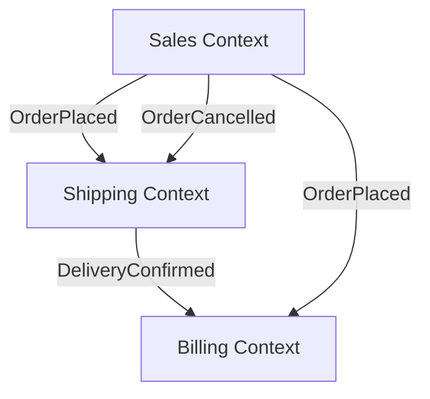

# Domain Analysis (DDD)

> **Quick Ref**: DDD starts with analysis, not code | Event Storming maps the domain visually | Bounded Contexts prevent the "one User class to rule them all" anti-pattern | Ubiquitous Language glossary = shared vocabulary between dev and business | Context Mapping defines how contexts talk to each other | Aggregates are consistency boundaries, not data containers |

Full domain-driven analysis workflow. Load when DDD or Clean Architecture is chosen as the project architecture (see `bootstrap-project.md` Step 1). Do this BEFORE writing any domain code — `domain-modeling.md` covers implementation; this file covers analysis.

## Step 0: Pause. Do Not Start Coding.

DDD is NOT about code patterns. It's about understanding the business. If you start with `public class Order : AggregateRoot`, you've already failed. Start with a whiteboard, a conversation, and sticky notes (real or virtual).

## Step 1: Event Storming (Map the Domain)

Event Storming is a workshop technique. You can run it with just the user in a conversation.

### Phase 1: Discover Domain Events (orange sticky notes)

Ask: "What HAPPENS in this system? Tell me everything that can occur."

Write every event as a past-tense verb phrase:

```
Order Placed
Payment Authorized
Inventory Reserved
Order Shipped
Delivery Confirmed
Order Cancelled
Refund Issued
```

**Rule**: Events describe things that HAPPENED. Not things the system does. "Order Placed" not "System Creates Order."

### Phase 2: Sort by Time (left to right)

Arrange events chronologically. This reveals the business process flow:

```
Order Placed → Payment Authorized → Inventory Reserved → Order Shipped → Delivery Confirmed
                                                       ↘ Order Cancelled → Refund Issued
```

### Phase 3: Identify Hotspots (pink sticky notes)

Ask: "Where do things go wrong? What are the edge cases?"

```
Order Placed → Payment Authorized → Inventory Reserved → Order Shipped → Delivery Confirmed
     │                                     │
     └─ HOTSPOT: What if item             └─ HOTSPOT: What if inventory is
        goes out of stock while              insufficient for the order size?
        customer is browsing?
```

Hotspots = business rules that need careful modeling. These become your domain logic.

## Step 2: Bounded Contexts (Draw Boundaries)

A bounded context is where a word has ONE meaning. When the same word means different things, it belongs in different contexts.

### Identify Contexts from Events

Group related events. Each group is a candidate bounded context:

```
[Sales Context]                    [Shipping Context]              [Billing Context]
 Order Placed                       Inventory Reserved              Payment Authorized
 Order Cancelled                    Order Shipped                   Refund Issued
                                    Delivery Confirmed
```

### Define Ubiquitous Language per Context

The SAME word means DIFFERENT things in different contexts. Document this:

| Term | [Sales] Meaning | [Shipping] Meaning | [Billing] Meaning |
|------|----------------|-------------------|------------------|
| Order | A customer's purchase commitment | A package to be shipped | An amount to be charged |
| Customer | The person who placed the order | The person receiving the package | The account being billed |
| Product | An item available for purchase | A physical item in the warehouse | A line item on an invoice |
| Status | Active, Cancelled | Pending, Picked, Shipped, Delivered | Pending, Authorized, Refunded |

**Critical**: Never share a `User` class between Sales and Billing. They are different concepts with different properties, even if they refer to the same real-world person.

### Context Map: How Contexts Communicate

```
[Sales] ──OrderPlaced event──→ [Shipping] ──DeliveryConfirmed event──→ [Billing]
   │                               │
   └──OrderCancelled event─────────┘
```

| Relationship | Pattern | Example |
|-------------|---------|---------|
| Upstream publishes, downstream subscribes | **Published Language** | Sales publishes `OrderPlaced`, Shipping subscribes |
| Both teams collaborate on shared model | **Partnership** | Sales + Billing agree on `Money` value object format |
| Downstream conforms to upstream | **Conformist** | Shipping accepts Sales' `Address` format as-is |
| Separate ways | **Separate Ways** | Reporting context doesn't need real-time data; uses nightly batch |

## Step 3: Identify Aggregates within Each Context

An aggregate is a cluster of objects treated as a unit for data changes. ONE entity is the root — all changes go through it.

### Rules for Aggregate Design

1. **Keep aggregates small.** A 50-entity aggregate is wrong. Most aggregates are 1-2 entities.
2. **Reference other aggregates by ID only.** No navigation properties crossing aggregate boundaries.
3. **One transaction = one aggregate.** If you need to change two aggregates, use domain events.
4. **Delete the root = delete everything inside.** Aggregates own their children's lifecycle.

### Example: Sales Context Aggregates

```
Order (Aggregate Root)
  ├── OrderLine (Entity — lives and dies with Order)
  ├── ShippingAddress (Value Object — immutable)
  └── OrderId (Strongly-typed ID)

Product (Aggregate Root — separate!)
  ├── ProductId
  └── — Order references Product by ProductId ONLY

Customer (Aggregate Root — separate!)
  └── — Order references Customer by CustomerId ONLY
```

**Why is Product separate?** An Order references a Product by ID. Changing a Product's price shouldn't lock the Order. Deleting an Order shouldn't delete the Product. Different aggregates = different lifecycles.

## Step 4: Document Everything (Before Coding)

Before writing ANY code, produce these artifacts:

### 4a: Domain Glossary

```markdown
## Domain Glossary

**Order** (Sales Context): A customer's commitment to purchase one or more products.
  Created when customer confirms their cart. Contains 1+ OrderLines.

**OrderLine**: A single product selection within an Order. Always belongs to exactly
  one Order. Has quantity and price-at-time-of-order (not current product price).

**Product** (Sales Context): An item available for purchase. Has name, description,
  current price, and inventory count. Referenced by Order.OrderLines by ProductId.

**ShippingAddress**: Where the order is delivered. Immutable — if customer changes
  address, a new Order gets the new address; existing orders keep the original.
```

### 4b: Context Diagram (Mermaid)



### 4c: Aggregate Decision Table

| Name | Root? | Children | References by ID |
|------|-------|----------|-----------------|
| Order | Yes | OrderLine, ShippingAddress | ProductId, CustomerId |
| Product | Yes | — | — |
| Customer | Yes | — | — |

## Anti-patterns (BAD vs GOOD)

### 1. Skipping analysis → building the wrong model

```
BAD: "I need orders. Let me create an Order class with Name, Price, Status."
     Two weeks later: "Wait, you said 'Order' means a purchase order for procurement,
     not a customer sales order?" Complete rewrite.

GOOD: 30 minutes of Event Storming + bounded context mapping.
      "Order in Sales means X. Order in Procurement means Y. Two separate contexts."
      Zero wasted code.
```

### 2. One shared class across contexts

```csharp
// BAD: One User class for everything. 40 properties. Most are null in most contexts.
public class User
{
    public string Email { get; set; }          // Used everywhere
    public string ShippingAddress { get; set; } // Only in Shipping context
    public string BillingAccount { get; set; }   // Only in Billing context
    public string LoyaltyTier { get; set; }      // Only in Marketing context
    // ... 36 more properties ...
}

// GOOD: Separate classes per context. Each has ONLY what that context needs.
// Sales Context
public record Customer(Guid Id, string Name, string Email);
// Shipping Context  
public record Recipient(Guid Id, string Address, string Phone);
// Billing Context
public record Payer(Guid Id, string AccountNumber, string BillingAddress);
```

### 3. Technical events instead of domain events

```csharp
// BAD: Events that describe what the CODE did, not what the BUSINESS did.
public record OrderSavedEvent(Guid OrderId);      // "Saved" is technical
public record EntityUpdatedEvent(Guid Id);         // "Updated" is meaningless
public record StatusChangedEvent(Guid Id, int Old, int New); // What changed? Why?

// GOOD: Events that describe business occurrences.
public record OrderPlacedEvent(Guid OrderId, Guid CustomerId, Money Total);
public record PaymentAuthorizedEvent(Guid OrderId, Money Amount);
public record InventoryReservedEvent(Guid OrderId, Dictionary<Guid, int> Items);
```

### 4. Mega-aggregates

```csharp
// BAD: One giant aggregate. Order contains Customer, Products, Inventory, Shipping, Billing.
// Every change locks 50 rows. Concurrent users block each other constantly.
public class Order : AggregateRoot
{
    public Customer Customer { get; set; }
    public List<Product> Products { get; set; }
    public Inventory Inventory { get; set; }
    public ShippingInfo Shipping { get; set; }
    public BillingInfo Billing { get; set; }
    // ...
}

// GOOD: Order is small. References other aggregates by ID.
public sealed class Order : AggregateRoot
{
    public OrderId Id { get; }
    public CustomerId CustomerId { get; }         // Reference by ID
    public List<OrderLine> Lines { get; }          // Owned
    public ShippingAddress Address { get; }        // Value object
    // Product, Inventory, Billing are separate aggregates.
}
```

## Decision Guide

| When | Do |
|------|-----|
| Starting a DDD project | Run Event Storming first. Code after. |
| Two contexts use the same word | Check: same meaning? If not, split into separate classes. |
| Contexts need to communicate | Use domain events (async). Never direct DB access across contexts. |
| Aggregate is > 3 entities | Re-examine. Can you split it? |
| Unsure about context boundary | Look at the ubiquitous language. Where does the word's meaning change? |
| Team is solo or pair | Full DDD may be overkill. Consider VSA + domain events without strict aggregates. |

## Cross-References

- `bootstrap-project.md` — Architecture selection (DDD is Step 1, option 3)
- `../dotnet-csharp/references/domain-modeling.md` — Implementing aggregates, value objects, domain events in C#
- `../dotnet-api/references/architecture-patterns.md` — Clean Architecture and DDD project structure
- `../USAGE.md` — Question before building (Step 0)
